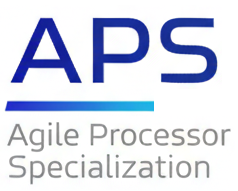
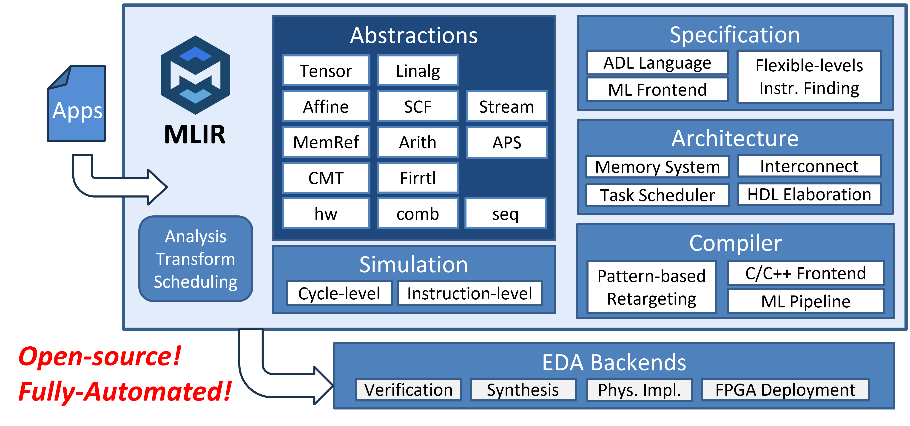

# APS: Agile Processor Specialization

APS (Agile Processor Specialization) is an open-source framework for agile hardware-software co-design of domain-specific processors. It provides both hardware synthesis and compiler infrastructure to facilitate the development of instruction extensions (ISAXs) for domain acceleration on RISC-V platforms.

## Quick Links

- **Home page:** [http://aps.ericlyun.me/](http://aps.ericlyun.me/)
- **Publications:** [http://aps.ericlyun.me/publications/](http://aps.ericlyun.me/publications/)
- **Tutorials:** [http://aps.ericlyun.me/tutorials/](http://aps.ericlyun.me/tutorials/)

## APS's Ecosystem



APS aims to build a comprehensive ecosystem based on the MLIR infrastructure, covering the entire hardware-software co-design flow. Our ultimate vision is to only take applications in the target domain as the inputs, and automatically generate the complete solution artifacts comprising optimized ISAXs, architecture designs, hardware implementation, and software stacks without any manual intervention.

## Overview

The framework consists of three major components:

### Hardware Synthesis

- **CADL**: A high-level domain-specific language for describing ISAXs (Instruction Set Architecture eXtensions). CADL provides intuitive syntax for register file access, memory operations, bit manipulation, and loop constructs, allowing designers to focus on algorithm logic rather than hardware details.
- **MLIR Passes**: A comprehensive set of transformation and optimization passes, including loop unrolling, array partitioning, SDC-based scheduling, and RTL generation.

### Compiler

Enables automatic utilization of custom instructions in application code:

- **Megg**: An E-graph based compiler that performs pattern matching to identify code fragments that can be replaced with custom instructions.
- **C/C++ Frontend**: Integration with Polygeist/cgeist for C/C++ to MLIR conversion.
- **LLVM Backend**: Code generation targeting RISC-V with custom instruction encodings.

### Architecture

Generates the complete hardware architecture for RISC-V integration:

- **CMT2 → FIRRTL → Verilog**: Multi-stage RTL generation pipeline using CIRCT infrastructure.
- **RoCC Interface**: Generates accelerators compatible with Rocket Chip's custom coprocessor interface.
- **Memory System**: Scratchpad memory pool with burst DMA support for efficient data movement.
- **Chipyard Integration**: Seamless integration with the Chipyard SoC framework for full-system simulation and FPGA deployment.

## Getting Started

### Prerequisites

- Linux (Ubuntu 22.04 recommended)
- [Pixi](https://pixi.sh/) package manager

### Installation

1. Clone the repository:
```bash
git clone https://github.com/arch-of-shadow/aps-mlir.git
cd aps-mlir
```

2. Setup chipyard
```bash
pixi run fix-verilator
pixi run setup-ortools
pixi run setup-yosys-slang
pixi run setup-firtool
pixi run setup-chipyard
```

3. Build CIRCT and APS passes:
```bash
rm -rf circt/build
pixi run setup
pixi run build
```

### Quick Start

The `tutorial/` directory contains example CADL files and scripts. Here's a simple example (`tutorial/cadl/hello.cadl`):

```cadl
#[opcode(7'b0101011)]
#[funct7(7'b0000000)]
rtype hello(rs1: u5, rs2: u5, rd: u5) {
  let a: u32 = _irf[rs1];
  let b: u32 = _irf[rs2];
  let c: u32 = a + b;
  _irf[rd] = c;
}
```

See the `tutorial/` directory for more examples including matrix operations (`vgemv3d.cadl`) and distance calculations (`v3ddist_vv.cadl`).

#### Full ASIP Pipeline
```bash
# Synthesize CADL to hardware
./tutorial/a1-ex1synth.sh
# Compile test program with custom instruction
./tutorial/a2-ex1compile.sh
# Full SoC simulation and synthesis
./tutorial/a6-ex1sim.sh
./tutorial/a7-ex1yosys.sh
```
